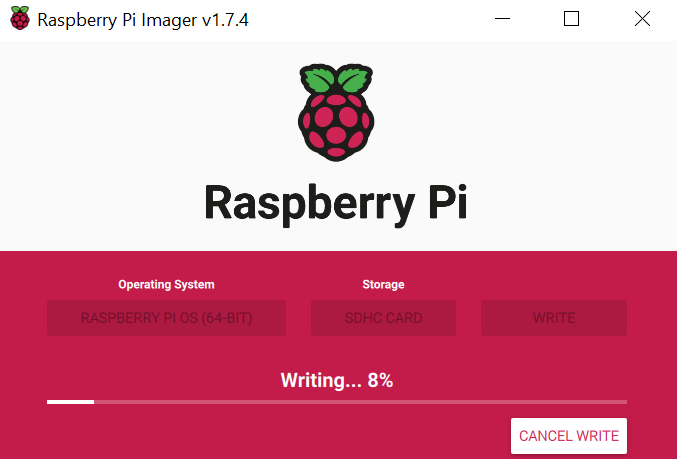
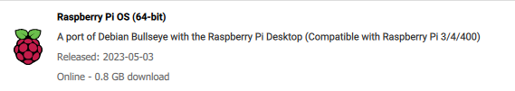
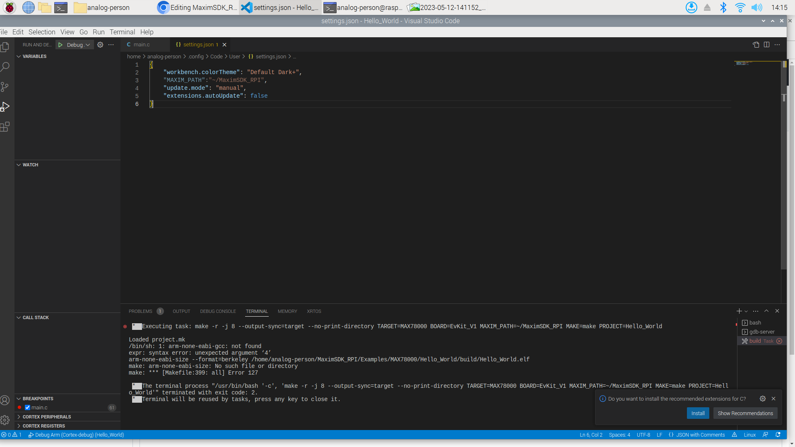
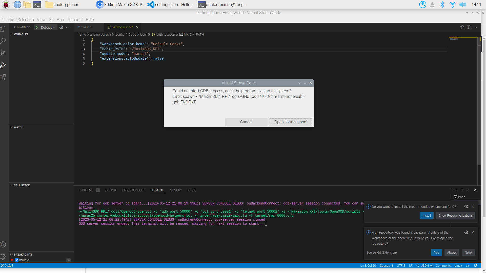

# MaximSDK_RPI
In this project I will be walking through the setup procedure to flash and debug the MAX78000 using a Raspberry Pi 4B. I will be using VSCode for editing, flashing, and debugging code.

# Project Setup
## Hardware Requirements
For this project I am using the Raspberry Pi 4B. Some older versions of RPI may be compatible, but I have not tested them myself. 

For a board to debug, I will be using the MAX78000FTHR with the provided microUSB cable.

## Software Requirements
Raspberry Pi has many OS versions compatible with the RPI 4B, but I have elected to use Raspberry Pi OS (64-Bit). The 64-bit version will only run on RPI 3/4/400 hardware, so any older boards will not be supported by this version of the Maxim SDK. Since I will be using VSCode, I obviously elected for the OS with a UI, but the drivers provided here should also work on headless version of the OS. It is iomportant to note that this version of Open On-Chip Debugger (OpenOCD) was compiled specifically for an AARCH-64 OS, so the OpenOCED binary file WILL NOT work on a 32-bit OS.

If you already have an RPI running a 64-bit OS, you can move onto the Setting up the SDK section. If starting from a fresh OS image, I recommend using the provided RPI imager (https://www.raspberrypi.com/software/). 

**RPI Imager:**

 

**RPI OS:**

# Setting up the SDK
Setup for the MaximSDK on the RPI is made simple with a basic installer script. The script takes care of the library dependencies and permissions.

# Setting up the VSCode Enviroment

# Debugging with VSCode

# Possible Issues
In this section I will outline a couple of known issues that I have encountered and possible resolutions.
- When attempting to debug in VSCode, you may encounter issues with an invalid path for compiler or debugger.  
