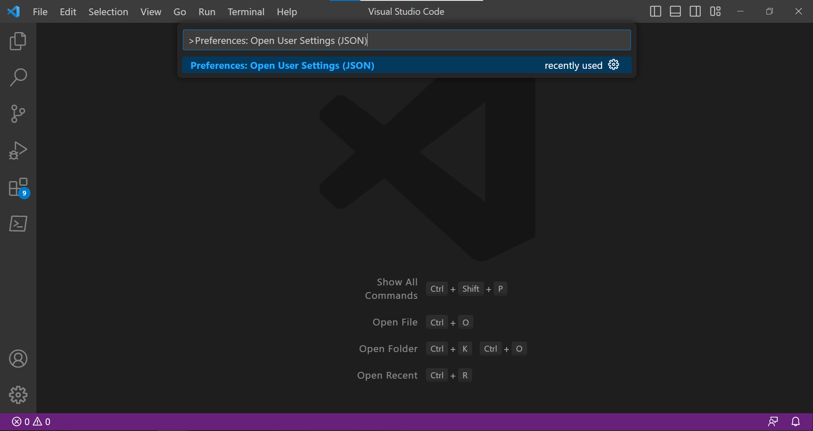
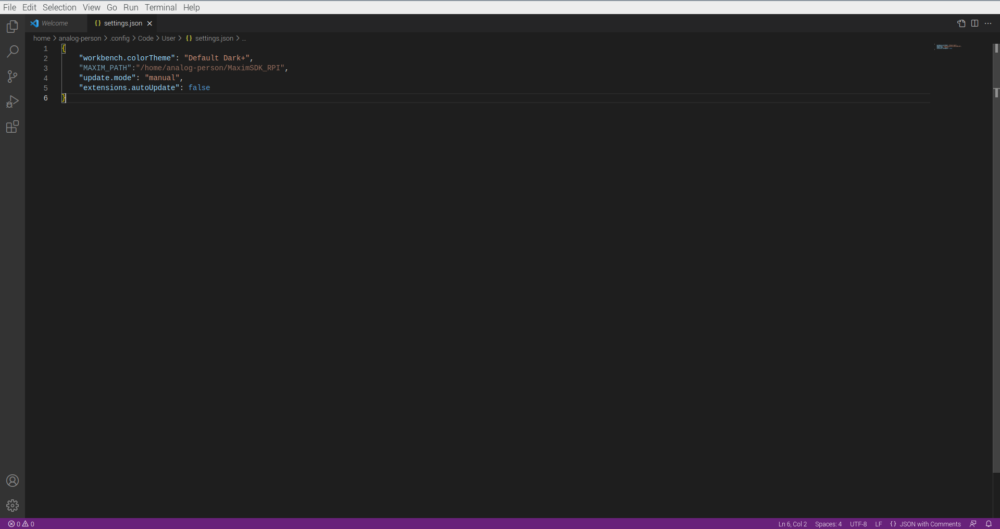

# MaximSDK_RPI
In this project I will be walking through the setup procedure to flash and debug the MAX78000 using a Raspberry Pi 4B. I will be using VSCode for editing, flashing, and debugging code.

# Project Setup
In this section I will discuss the hardware and software setup for your Raspberry Pi.

## Hardware Requirements
For this project I am using the Raspberry Pi 4B. Some older versions of RPI may be compatible, but I have not tested them myself. 

For a board to debug, I will be using the MAX78000FTHR with the provided microUSB cable.

## Software Requirements
Raspberry Pi has many OS versions compatible with the RPI 4B, but I have elected to use Raspberry Pi OS (64-Bit). The 64-bit version will only run on RPI 3/4/400 hardware, so any older boards will not be supported by this version of the Maxim SDK. Since I will be using VSCode, I obviously elected for the OS with a UI, but the drivers provided here should also work on headless version of the OS. It is iomportant to note that this version of Open On-Chip Debugger (OpenOCD) was compiled specifically for an AARCH-64 OS, so the OpenOCED binary file WILL NOT work on a 32-bit OS.

If starting from a fresh OS image, I recommend using the provided RPI imager (https://www.raspberrypi.com/software/). 

**RPI Imager:**

 

**RPI OS:**


# Setting up the SDK
Before you can begin the MSDK setup on your Raspberry Pi, you need to make sure you have Git installed. Open up a terminal window. You can quickly verify that Git is installed by checking the version
```
git --version
```

Once you have verified that Git is installed, it is time to install the MaximSDK_RPI repo. The recommended installation location is the home directory of the Raspberry Pi. This will help simplify the VSCode setup later. If you are unsure of the home directory path, you can easily find it by using the Linux shortcut `~`. Change into the home directory, and clone the Maxim_RPI repo:
```
cd ~
sudo git clone https://github.com/lypinator/MaximSDK_RPI.git
```

Once the repo has finished downloading, you need to enter the cloned directory and run the `configureSDK.sh` setup script. In order to run the script, you have to first make it an executable. The script installs the required dependencies for running the Open On-Chip Debugger (OpenOCD) binary files, and it sets up your permissions so that OpenOCD can access the USB port. The setup is as simple as:

```
cd ~/MaximSDK_RPI
sudo chmod +x configureSDK.sh
sudo ./configureSDK.sh
```

Once the configuration script has finished running, it is time to move onto setting up your VSCode IDE. 

# Setting up the VSCode Enviroment
If you would prefer to debug without a user-interface (or on a headless OS) you can follow the MSDK Linux setup guide here: https://analog-devices-msdk.github.io/msdk/USERGUIDE/#linuxmacos

VSCode is now supported on Raspberry Pi OS, so if you have a desktop on your RPI's OS, I highly recommend using VSCode. It is a great IDE for both writing firmware as well as debugging. One great feature of the MSDK is that it directly supports VSCode integration, so the setup is pretty simple. You can install and open a VSCode window by opening a terminal window and typing out: 

```
sudo apt-install code -y
code
```

This will install VSCode and open up a window. Once VSCode opens up, it will ask you to select the color theme. After selecting the color theme, open up the developer console using the hotkey `CTRL+SHIFT+P`. Use the developer console prompt to open the user settings by typing in: `Preferences: Open User Settings (JSON)`



All of the SDK libraries, drivers, compilers, and debuggers are linked based on the installation path of the MAXIM_RPI MSDK. In order to tell VSCode where to find the MSDK installation, we have to add in the `MAXIM_PATH` variable to this user settings file. An important thing to note is that while Linux recognizes the `~` symbol as a shortcut to the home directory, VSCode cannot resolve this type of file path. That means that you have to type out the full file path of your MSDK installation. We are also going to use the user settings file to disable automatic updates for VSCode and the VSCode extensions.

In case some additional setting(s) were already configured in the user settings file, make sure to leave them and append this information. An example for a username of "analog-person" should look sometihng like the following:

```
MAXIM_PATH="/home/analog-person/MaximSDK_RPI",
"update.mode": "manual",
"extensions.autoUpdate": false,
```




After saving these changes, we need to restart VSCode so that the new user settings are loaded from the JSON file. Simply close out this VSCode window and open a new one via terminal command `code`. After restartomg the program, the VSCode enviroment has been setup, and it is time to start working with the micro.

# Getting Started with VSCode

The MSDK was developed to work seamlessly with VSCode. The RPI version of VSCode works identically to the Windows or MacOS versions. 
- **Offical MSDK VSCode Extension:** https://github.com/Analog-Devices-MSDK/VSCode-Maxim#usage
- **Offical MSDK User Guide:** https://analog-devices-msdk.github.io/msdk/USERGUIDE/#visual-studio-code

Both of the above links will walkthrough the basics of getting started with VSCode for firmware development and debugging.


# Possible Issues
In this section I will outline a couple of known issues that I have encountered and possible resolutions.
- When attempting to debug in VSCode, you may encounter issues with an invalid path for compiler or debugger.  
