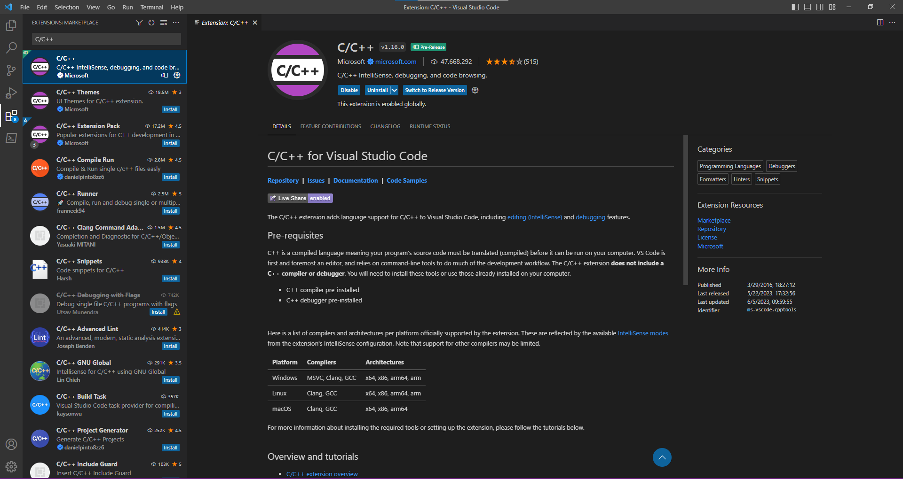

# MaximSDK_RPI
This project walks through the setup procedure to flashing and debugging the MAX78000 using a Raspberry Pi 4B. VSCode will be used for editing, flashing, and debugging code.

# Project Setup
This section discusses the hardware and software setup for your Raspberry Pi.

## Hardware Requirements
For this project the Raspberry Pi 4B has been selected. RPI 3/4/400 hardware versions of RPI may be compatible, but they are untested. 

$~$

**RPI4B**

 

For testing the RPI's ability to flash and debug code, the MAX78000FTHR board with a micro-usb connector is used.

$~$

**MAX78000FTHR + MicroUSB Cable**

 

$~$

## Software Requirements
While Raspberry Pi has many OS versions compatible with the RPI 4B, this walkthrough uses the Raspberry Pi OS (64-Bit). The 64-bit version will only run on RPI 3/4/400 hardware, so any older boards will not be supported by this version of the MSDK. VSCode requires an OS with a UI, but the drivers provided for thre MSDK should also work on headless version of the OS. It is iomportant to note that this version of Open On-Chip Debugger (OpenOCD) was compiled specifically for an AARCH-64 OS, so the OpenOCD binary file WILL NOT work on a 32-bit OS.

If starting from a fresh OS image, the Raspberry Pi OS (64-bit) image can be downloaded and formatter using the [RPI imager](https://www.raspberrypi.com/software/) provided by the Raspberry Pi website. 

$~$

**RPI Imager:**

 

$~$

**RPI OS:**


$~$

# Setting up the SDK
First, verify that 'Git' is installed. This should be a default package in the Raspberry Pi OS, but quickly verify that Git is installed by checking the version in a Terminal Window using the following command:

```
git --version
```

Once it is confirmed that Git is installed, it is time to download the MaximSDK_RPI repo. The recommended installation location is the home directory of the Raspberry Pi. This will help simplify the VSCode setup later. Using the `cd` command in the Terminal Window, enter the home directory by using the Linux filepath shortcut `~`. Once inside the home directory, use git to clone the Maxim_RPI repository.

```
cd ~
sudo git clone https://github.com/lypinator/MaximSDK_RPI.git
```

Once the repo has finished downloading, `cd` into the cloned directory. In order to run the the setup script, `configureSDK.sh`, you have to first make it an executable script. The script installs the required dependencies for running the Open On-Chip Debugger (OpenOCD) binary file, and it sets up your permissions so that OpenOCD can access the USB port. The setup is as simple as:

```
cd ~/MaximSDK_RPI
sudo chmod +x configureSDK.sh
sudo ./configureSDK.sh
```

Once the configuration script has finished running, the final step is changing the owner of the downloaded repository. By default, the VSCode application only has permission to create and modify files that are owned by the user that starts VSCode. In order to ensure that all of the downloaded MSDK files and directories are owned by the current user, we can use the change owner command, `chown`, as shown below:

```
sudo chown -R <YOUR USERNAME> ~/MaximSDK_RPI
```

Please note that the expression `<YOUR USERNAME>` is a place holder for... you guessed it... your username. As an example, if the RPI username is 'analog-person', than set permissions with:

```
sudo chown -R analog-person ~/MaximSDK_RPI
```

This command will give the RPI user specified in `<Your USERNAME>` ownership of all the sub-directories and files held within the `~/MaximSDK_RPI` directory. That way if VSCode is launched from the terminal window by the RPI user, then it can still read/write all the files in the MSDK.

At the end of this section the MSDK repo should be downloaded, dependencies and configurations should be taken care of via the `configureSDK.sh` script, and the MaximSDK_RPI directory should be owned by the current user. If all 3 conditions are true, then the RPI is ready to build, flash, and debug MSDK compatible microcontrollers. 

Using the MSDK for debugging without a user-interface (or on a headless OS) is possible on all Limux based operating systems (including RPI). The [MSDK Linux setup guide](https://analog-devices-msdk.github.io/msdk/USERGUIDE/#linuxmacos) goes through opening up an OpenOCD port and connecting it to a GDB session. This allows for the use of GDB in a terminal window, and no UI or VSCode install is required.

If the VSCode IDE is being used, then please continue on to the next section.

$~$

# Setting up the VSCode Enviroment
This section will go through the installation and setup of VSCode with MSDK support. One great feature of the MSDK is that it directly supports VSCode integration, so the setup is simple. Install and open a VSCode window by opening a terminal window and typing out: 

```
sudo apt install code -y
code
```

This will install VSCode and open up a VSCode window. Once VSCode opens up, there may be some initial setup prompts like setting the color theme for the IDE. If there is an inital prompt, feel free to fill out these initial setting(s). Once completed, open up the developer console by using the hotkey combo `CTRL+SHIFT+P`. Use the developer console prompt to open the user settings by typing in: `Preferences: Open User Settings (JSON)`


All of the MSDK libraries, drivers, compilers, and debuggers are linked based on the installation path of the MaximSDK_RPI directory. In order to tell VSCode where to find the MSDK installation, the `MAXIM_PATH` variable must be added to this user settings file. An important thing to note is that while Linux recognizes the `~` symbol as a shortcut to the home directory, VSCode cannot resolve this type of file path. That means that in order for VSCode to know where to find MSDK files, the FULL file path of the MaximSDK_RPI directory must be used. 

When intially openning the User Settings file, it may not be empty. There could be one of more settings already saved in this JSON file. Those settings should be kept exactly as they are, and the MSDK settings should be apended just before the `}`. 

```
MAXIM_PATH="/home/<YOUR USERNAME>/MaximSDK_RPI",
"update.mode": "manual",
"extensions.autoUpdate": false,
```

Please note that the expression `<YOUR USERNAME>` is a place holder for the username of the current RPI user profile. In the following screenshot, this placeholder was replaced with a sample username, analog-person, to show what the User Settings file should look like once you are done. Please also note that this example User Settings file already had the color theme settings set when the file was first opened. As mentioned above, the MSDK setttings were simply appended after `"workbench.colorTheme": "Default Dark+",`


After saving these changes, restart VSCode so that the new user settings are loaded from the JSON file. This can be done by closings out this VSCode window and opening a new one via terminal command `code`. 

The last step for setting up the MSDK in VSCode is intalling the C/C++ extension and the Cortex-Debug extension. Open up the VSCode Extensions Marketplace in the VSCode window by using the hotkey combo `CTRL+SHIFT+X`. Using the Extensions Marketplace search tool, find the `C/C++` extension and install it.

**C/C++ Extension**


$~$

Follow the same procedure for installing the Cortex-Debug extension. 

**Cortex-Debug Extension**


$~$

At the end of this section VSCode should be installed on the RPI, the `MAXIM_PATH` variable should be set in the User Settings JSON file in VSCode, and both C/C++ and Cortex-Debug extensions should be installed in VSCode. If all of these steps have been completed, then the MSDK is fully setup and configured on the RPI. No additional downloads or configurations are required, and the VSCode IDE can be used for writing, flashing, and debugging code the same as it would runnig on any other OS. 

The following section will provide links to the offical MSDK User Guide. These links will provide the most up to date instructions on using VSCode for building/flashing/debugging code. If this is the first time using VSCode, it is recommended to look through the offical documentation and learn best practices for effectivley using VSCode. 

$~$

# Getting Started with VSCode

The MSDK was developed to work seamlessly with VSCode. The RPI version of VSCode works identically to the Windows or MacOS versions. The following links provide a more in-depth look at using VSCode for building up applications. These documents are well-maintained, and they offer the most up to date information regarding the MSDK, VSCode, and new features/updates that added over time.

$~$

- **[Offical MSDK User Guide](https://analog-devices-msdk.github.io/msdk/USERGUIDE/#visual-studio-code)** :  This user guide is aimed at supporting the full MSDK, not just the VSCode extension. That being said, there is a great introduction to using VSCode in the `Visual Studio Code` section of the user guide. This document goes into less depth regarding the MSDK integration with VSCode, and focuses mainly on using VSCode for building, flashing, and debugging MSDK example projects. This is the reomended document to follow for interfacing the RPI with any MSDK compatible microcontroller.

- **[Offical MSDK VSCode Extension](https://github.com/Analog-Devices-MSDK/VSCode-Maxim#usage)** : The second important document to look at is the Offical MSDK VSCode Extension Guide. Navigate to the `Usage` section and follow the instructions for Opening Projects, Build Tasks, and Debugging. This is the offical documentation for the VSCode extension using the MSDK, so it goes into great depth on configuring the build scripts, navigating the VSCode interface, and setting up the debugger. This document will provide an in-depth look at how the MSDK interfaces with VSCode.

$~$

$~$

At the end of this section the links above should have offered guidance on using the MSDK with VSCode, and the installation should be verefied by building, flashing, and then debugging the example `Hello_World` project. If all steps of the debug process work sucessfully, then the installation was configured correctly, and VSCode can be used on the RPI to debug MSDK compatible microcontrollers. If any issues arise at any part of the building, flashing, or debugging, please proceed to the next section that documents some of the issues that can arise when installing the MSDK for VSCode on the RPI.

# Possible Issues
This section gives some examples of issues that have been observed when the MSDK is not setup properly with VSCode. 

$~$

## Bad MSDK Installation Path
When attempting to build a project or debug in VSCode, you may encounter issues with an invalid path for compiler or debugger. Error messages are shown below:

$~$

**Error thrown when attempting to build a project:**

 

$~$

**Error thrown when attempting to debug a project:**


$~$

**FIX:** Open up the developer console using the hotkey `CTRL+SHIFT+P`. Use the developer console prompt to open the user settings by typing in: `Preferences: Open User Settings (JSON)`. Make sure that the MAXIM_PATH variable is set correctly. Remember that this file path must be hard-coded in, and no shortcuts (such as using `~` for home directory) can be used.

$~$

## OpenOCD Port Busy
When attempting to flash or debug, VSCode may give an error: `OpenOCD: GDB Server Quit Unexpectedly. See gdb-server output in TERMINAL tab for more details.` One issue that could produce this error is an OpenOCD instance is already running on the RPI. This can be caused by having another VSCode window open and still conected to the debugger, from manually opening an OpenOCD connection in a terminal window, or from VSCode not closing properly.

$~$

**Error thrown when OpenOCD port is busy:**


$~$

**FIX:** Open up a terminal window and check to see if an OpenOCD instance is already running by typing `lsof -i tcp`. If any of the TCP connection has "OpenOCD" as the command, note the PID number. Kill the PID by typing `sudo kil <PID>`. An example is shown below.

$~$

**Find OpenOCD PID and Kill the Process:**


$~$

**After the Process has been cleared:**


$~$

At the end of this section, any issues or errors for building, flashing, or debugging using the MSDK with VSCode should be resolved. New issues and resolutions will be added as they come up.